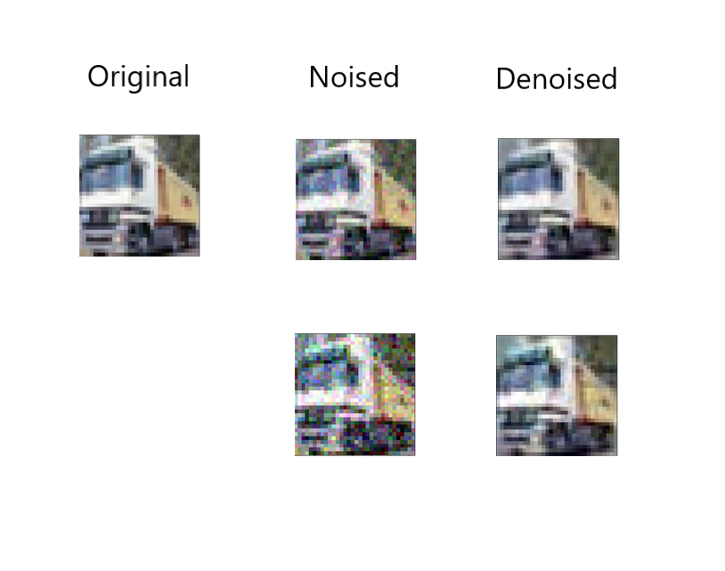

# Denoising AutoEncoders

Using AutoEncoders to denoise images

## Training Data Used

The model was trained with the [CIFAR-10](https://www.cs.toronto.edu/~kriz/cifar.html) dataset, each image was size 32x32x3

## Adding Noise

During both training and testing **Gaussian Noise** was added, by directly adding gaussian random numbers to the image, the multiplying factor on noise used during training was 0.05, though while testing different multiplying factors were tried.

## Architecture

**Symmetric Conv-Deconv Architecture was used in the model**

The exact model architecture used was as follows:

*Conv - Convolution Layer*  
*DeConv - Transposed Convolution layer*  
*(a,b)C - a channels in, b channels out*  
*(n,n)F - filter of nxn*

> **Layer 1 - Conv (3,96)C  (5,5)F**  
**Layer 2 - Conv (96,120)C  (5,5)F**  
**Layer 3 - Conv (120,180)C  (5,5)F**  
**Layer 4 - DeConv (180,120)C  (5,5)F**  
**Layer 5 - DeConv (120,96)C  (5,5)F**  
**Layer 6 - DeConv (96,3)C  (5,5)F**  

**Adam** Optimization was used and learning rate was - **0.001**

## Results

The model was allowed to learn for 6 epochs.

The results obtained are:

*The first row shows the result when noise multiplying factor was 0.1(on which the model was trained) and second column shows result when noise multiplying factor was 0.05*

## Testing on a larger Image

The model was also tried on a larger image of dimensions 1024x1024x3, the following image was used:  

The image was first broken into pieces of size 32x32x3, on which the model works, the result was calculated and then reassembled into an image, the following results were obtained:

  
**Noised**  
  
**Denoised**

The results are affected by the fact that the model is working on smaller segments of the picture instead of looking at the bigger picture itself, and also the fact that the multiplying factor used to noise this image was 0.67, which is much larger than a factor of 0.05 on which the model was trained.

> To open Colab notebook goto - https://colab.research.google.com/github/ and then copy and paste the notebook links from the repository, or directly goto https://colab.research.google.com/github/ZeoDarkflame/Denoising_AutoEncoders/blob/master/AutoEncoder_Playground
